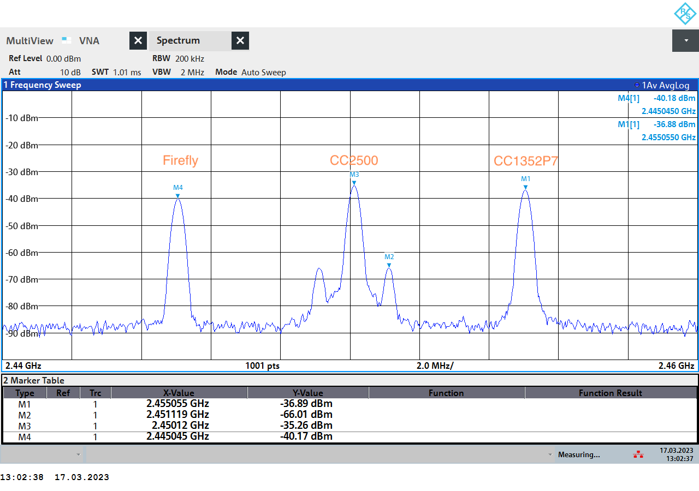
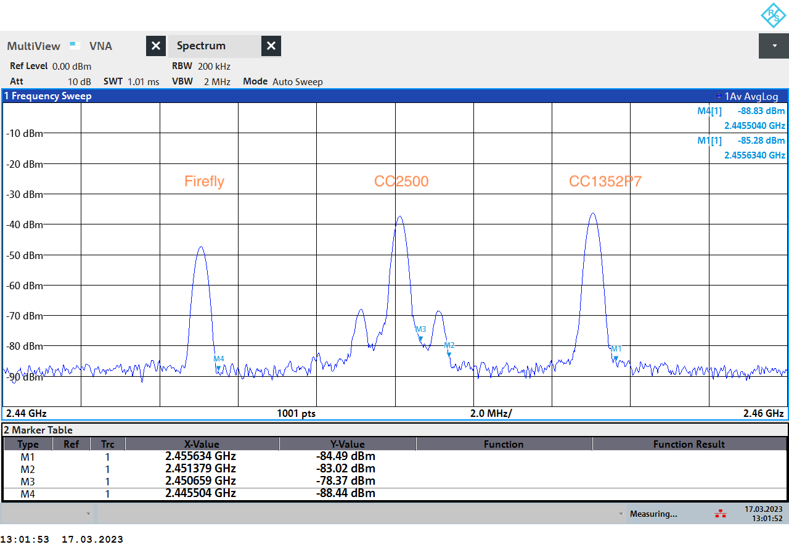

# Carrier characteristics

The provided images can be used to estimate the typical carrier bandwidth of the different nodes:
- the CC2500 was configured for a  $f_c=2450$ MHz carrier, had an error of $f_e = 0.12$ MHz and two side lobes at $\pm 1$ MHz. The combined bandwidth of all three lobes was ~2.5 MHz:
    - center: $(f_c + f_e)$ MHz
    - center bandwidth: ~1.078 MHz
    - right-lobe: $(f_c + f_e + 1)$ MHz
    - right-lobe bandwidth: ~0.520 MHz
    - left-lobe: $(f_c + f_e - 1)$ MHz
    - left-lobe bandwidth: ~0.520 MHz
- the CC1352P7 was configured for a $f_c=2455$ MHz carrier:
    - center: $f_c$ MHz
    - center bandwidth: ~1.158 MHz
- the Firefly was configured for a $f_c=2445$ MHz carrier
    - center: $f_c$ MHz
    - center bandwidth: ~0.918 MHz

## Center

## Edge

