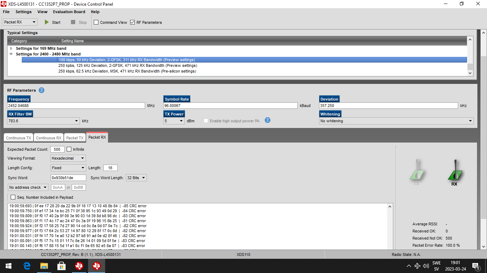

# Pico-Backscatter: carrier-receiver-CC1352
The configuration for Firefly to generate a unmodulated carrier in the range of 2394MHz to 2507MHz.
Control the launchpad via SmartRF studio.

## Installation
SmartRF™ Studio is a **Windows** application that helps designers of RF systems to easily evaluate the radio at an early stage in the design process for all TI CC1xxx and CC2xxx low-power RF devices.
  Please follow the installation guidance on Texas Instrument webpage [SmartRF Studio](https://www.ti.com/tool/SMARTRFTM-STUDIO#:~:text=SmartRF%E2%84%A2%20Studio%20is%20a%20Windows%20application%20that%20can%20be,stage%20in%20the%20design%20process.)

## Carrier
In the control panel, choose `Continuous TX`, `Unmodulated`, `Frequency`, `Transmission power 0dBm`
 Then click `Start`.

## Packet Receiver
In the control panel, choose `2.4G frequency band`, `Packet RX`
 `Base Freqeuncy`: $f_{R}$
 `Data Rate`: $R_{b}$
 `Deviation`: $\delta_{FSK}$
 `RX Filter BW`: $B_{R}$
 `Viewing Format` : Hexadecimal
 `Seq. Number Included in Payload`: uncheck
 `Length Config`: fixed (set the number based on the frame size configured on tag), or variable (use the length field to decide the frame length)
 Then click `Start`

## A screenshot of the SmartRF configuration as receiver

## Backscatter Tag Configuration
Please change the Macro variable RECEIVER to 1352.

## Reference
[CC1352P7 Datasheet](https://www.ti.com/product/CC1352P7)
